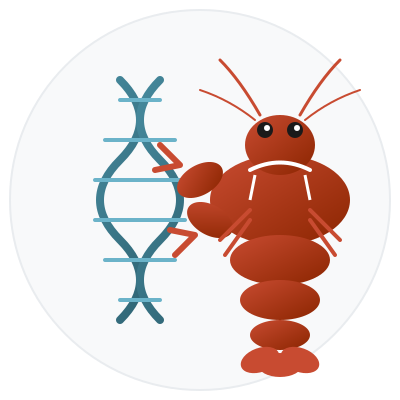

# Personal Genomics v4.2.0

Privacy-first local DNA analysis for AI agents. Comprehensive genetic analysis with **1600+ validated markers** across **30 categories** covering pharmacogenomics, disease risk, carrier status, haplogroups, ancestry, hereditary cancer, autoimmune conditions, pain sensitivity, lifestyle optimization, and more.

**NEW in v4.2.0: Interactive HTML Dashboard!**



## Features

### Core Analysis
- **1600+ validated genetic markers** across 30 categories
- **Polygenic Risk Scores (PRS)** for 10+ major conditions with population calibration
- **Pharmacogenomics** with CPIC Level 1A drug-gene interactions
- **Medication Interaction Checker** - cross-reference any medication list
- **Carrier screening** for 35+ recessive diseases including rare diseases
- **VCF support** for whole genome/exome sequencing
- **Agent-friendly JSON output** with priority-sorted actionable items
- **Zero network requests** - all analysis runs locally
- **Universal ethnic coverage** - works for all ancestries worldwide

### New in v4.0

🧬 **Haplogroup Analysis**
- Mitochondrial DNA (mtDNA) haplogroups for maternal lineage
- Y-chromosome haplogroups for paternal lineage
- Migration history context for each haplogroup
- Based on PhyloTree and ISOGG standards

🌍 **Ancestry Composition**
- Reference population comparisons (EUR, AFR, EAS, SAS, AMR)
- Admixture detection from SNP data
- Ancestry informative markers (AIMs)
- Sub-population resolution where data supports

🎗️ **Expanded Hereditary Cancer Panel**
- BRCA1/BRCA2 comprehensive coverage
- Lynch syndrome genes (MLH1, MSH2, MSH6, PMS2)
- Other hereditary cancer markers (APC, TP53, CHEK2, PALB2, ATM)
- ACMG-style variant classification

🔬 **Autoimmune HLA Associations**
- Celiac disease (HLA-DQ2, DQ8) with rule-out capability
- Type 1 Diabetes associations
- Ankylosing spondylitis (HLA-B27)
- Rheumatoid arthritis, lupus, multiple sclerosis markers

💊 **Pain Sensitivity**
- COMT Val158Met (pain perception, opioid response)
- OPRM1 A118G (opioid receptor function)
- SCN9A (pain signaling)
- TRPV1 (capsaicin/thermal sensitivity)
- Migraine susceptibility markers

📄 **PDF Report Generation**
- Professional, physician-shareable format
- Executive summary section
- Detailed findings by category
- Actionable recommendations
- Disclaimers and limitations

📊 **Data Quality Metrics**
- Call rate analysis
- No-call position tracking
- Chromosome coverage analysis
- Platform/chip detection
- Confidence scoring for variants

🔗 **Integration & Export**
- Genetic counselor clinical export (ACMG-style)
- Apple Health compatible format
- API-ready JSON structure
- Integration hooks for health trackers

### New in v4.1.0

💊 **Medication Interaction Checker**
- Input any list of medications (generic or brand names)
- Cross-references with pharmacogenomics profile
- Critical, serious, moderate, and minor severity levels
- Dosing adjustments and alternative medication suggestions
- PubMed citations for each interaction
- FDA warning flags

🌙 **Sleep Optimization Profile**
- Chronotype determination (CLOCK, PER2, PER3 genes)
- Caffeine metabolism speed (CYP1A2)
- Adenosine receptor sensitivity (ADORA2A)
- Personalized wake/sleep time recommendations
- Coffee cutoff time based on genetics
- Short sleeper gene detection

🥗 **Dietary Interaction Matrix**
- Caffeine tolerance (CYP1A2)
- Alcohol metabolism (ADH1B, ALDH2 - flush detection)
- Saturated fat response (APOE-specific recommendations)
- Lactose tolerance (LCT)
- Celiac disease risk (HLA-DQ2/DQ8)
- Bitter taste perception (TAS2R38)
- Omega-3 conversion efficiency (FADS1)
- Iron overload risk (HFE)

### New in v4.2.0

🖥️ **Interactive Web Dashboard**
- Beautiful, responsive HTML visualization
- Auto-generated with every analysis
- No external dependencies - works offline
- Dark mode support
- Sections: Overview, Pharmacogenomics, Health Risks, Traits, Ancestry, Carrier Status, Sleep, Athletic, UV/Skin, Dietary
- Export to PDF (print functionality)
- Drag & drop JSON loading

🛡️ **Code Quality Improvements**
- Complete type hints throughout codebase
- TypedDict for complex return types
- Comprehensive docstrings (Google style)
- Defensive programming with input validation
- Graceful handling of malformed data
- User-friendly error messages
- 200+ automated tests

📊 **Enhanced Visualizations**
- PRS percentile bars with color coding
- Power vs Endurance athletic gauge
- Sleep chronotype display
- Skin type estimation visuals
- Dietary interaction matrix
- Collapsible sections
- Search/filter functionality

🏃 **Athletic Performance Profiling**
- Endurance vs power composite score
- Key markers: ACTN3, ACE, PPARGC1A
- Recovery profile (TNF, IL6, BDNF)
- Injury susceptibility (COL5A1, COL1A1, GDF5)
- VO2max potential indicators
- Sport suitability recommendations
- Personalized training guidance

☀️ **UV Sensitivity Calculator**
- Estimated Fitzpatrick skin type from genetics
- MC1R, SLC24A5, SLC45A2, IRF4, TYR markers
- SPF recommendations by skin type
- Melanoma risk assessment
- Vitamin D synthesis capacity
- Sun exposure guidelines

📝 **Natural Language Explanations**
- Plain-English interpretation of all findings
- Jargon-free explanations
- Calibrated uncertainty language
- Practical implications for each finding
- Context for relative risks

🔬 **Research Variant Flagging**
- Clear separation of "established" vs "emerging" findings
- Evidence level classification for each marker
- Research context for preliminary findings
- Appropriate uncertainty communication

📚 **PubMed References**
- Direct links to source papers for major findings
- Primary citations for CPIC guidelines
- PMID references throughout

🧬 **Runs of Homozygosity Detection**
- Heterozygosity rate calculation
- Sensitive handling of consanguinity findings
- Genetic counselor referral recommendations

⏳ **Telomere Length Estimation**
- TERT, TERC, OBFC1 variants
- Longevity-associated markers (FOXO3, APOE)
- Clear caveats about limitations
- Lifestyle factor context

## Supported Formats

- 23andMe (v3, v4, v5)
- AncestryDNA
- MyHeritage
- FamilyTreeDNA
- Nebula Genomics
- VCF files (whole genome/exome, gzipped supported)
- Any tab-delimited rsid format

## Installation

```bash
# Install via clawhub (recommended)
clawhub install personal-genomics

# Or clone directly
git clone https://github.com/wkyleg/personal-genomics.git
cd personal-genomics
pip install -r requirements.txt
```

## Usage

### Command Line

```bash
python comprehensive_analysis.py /path/to/dna_file.txt
```

### As OpenClaw Skill

```
Analyze my DNA file at ~/Downloads/genome.txt
```

### Generate PDF Report

```bash
python -c "
from comprehensive_analysis import load_dna_file, main
from pdf_report import generate_pdf_report
# Run main analysis, then generate PDF from results
"
```

### Output Files

Reports are saved to `~/dna-analysis/reports/`:

- `dashboard.html` - **NEW!** Interactive visualization dashboard
- `agent_summary.json` - AI-optimized output with priority-sorted actionable items
- `full_analysis.json` - Complete analysis data
- `report.txt` - Human-readable report
- `genetic_report.pdf` - Professional PDF report

### Export Formats

```python
from exports import export_all_formats, generate_genetic_counselor_export

# Export all formats
paths = export_all_formats(analysis_results)

# Clinical export for genetic counselors
clinical = generate_genetic_counselor_export(analysis_results)
```

## Marker Categories

| Category | Markers | Description |
|----------|---------|-------------|
| Pharmacogenomics | 159 | Drug metabolism (CYP450, DPYD, TPMT, HLA) |
| Polygenic Risk | 277 | Disease risk scores (CAD, T2D, cancer, etc.) |
| Carrier Status | 181 | Recessive disease carriers (CF, sickle cell, Tay-Sachs) |
| Health Risks | 233 | Disease susceptibility (APOE, Factor V, AMD) |
| Traits | 163 | Physical, sensory, behavioral traits |
| **Haplogroups** | 44 | mtDNA + Y-DNA lineage markers |
| **Ancestry AIMs** | 124 | Ancestry informative markers |
| **Hereditary Cancer** | 41 | BRCA, Lynch syndrome, other cancer genes |
| **Autoimmune HLA** | 31 | HLA disease associations |
| **Pain Sensitivity** | 20 | Pain perception, opioid response |
| Rare Diseases | 29 | Rare genetic conditions |
| Mental Health | 25 | Psychiatric genetics |
| Dermatology | 37 | Skin conditions |
| Vision & Hearing | 33 | Sensory conditions |
| Fertility | 31 | Reproductive health |
| Nutrition | 34 | Nutrigenomics |
| Fitness | 30 | Athletic performance |
| Neurogenetics | 28 | Cognition, behavior |
| Longevity | 30 | Aging markers |
| Immunity | 43 | HLA, autoimmunity |

## Agent-Friendly Output

The `agent_summary.json` is designed for AI agents to quickly identify what matters:

```json
{
  "critical_alerts": [...],
  "high_priority": [...],
  "medium_priority": [...],
  "pharmacogenomics_alerts": [...],
  "apoe_status": {
    "genotype": "ε3/ε4",
    "risk_level": "elevated",
    "recommendations": [...]
  },
  "polygenic_risk_scores": {
    "cad": {"percentile_estimate": 75, "confidence": "moderate"},
    "t2d": {"percentile_estimate": 42, "confidence": "moderate"}
  },
  "haplogroups": {
    "mtDNA": {"haplogroup": "H", "confidence": "high", "lineage": "maternal"},
    "Y_DNA": {"haplogroup": "R1b", "confidence": "high", "lineage": "paternal"}
  },
  "ancestry": {
    "primary": "European",
    "composition": {"European": 85, "Middle Eastern": 10, "Other": 5}
  },
  "lifestyle_recommendations": {
    "diet": [...],
    "exercise": [...],
    "supplements": [...],
    "avoid": [...]
  },
  "drug_interaction_matrix": {
    "critical_interactions": [...],
    "warnings": [...],
    "dosing_adjustments": [...]
  }
}
```

## New Analysis Functions (v4.0)

### Haplogroup Analysis
```python
from markers.haplogroups import analyze_haplogroups

result = analyze_haplogroups(genotypes)
# Returns maternal (mtDNA) and paternal (Y-DNA) lineage with history
```

### Ancestry Composition
```python
from markers.ancestry_composition import get_ancestry_summary

result = get_ancestry_summary(genotypes)
# Returns population composition estimates and admixture detection
```

### Hereditary Cancer Panel
```python
from markers.cancer_panel import analyze_cancer_panel

result = analyze_cancer_panel(genotypes)
# Returns pathogenic/likely pathogenic variants with ACMG classification
```

### Autoimmune Risk
```python
from markers.autoimmune_hla import analyze_autoimmune_risk

result = analyze_autoimmune_risk(genotypes)
# Returns HLA-based autoimmune disease susceptibility
```

### Pain Sensitivity
```python
from markers.pain_sensitivity import analyze_pain_sensitivity

result = analyze_pain_sensitivity(genotypes)
# Returns pain perception profile and opioid response expectations
```

### Data Quality
```python
from data_quality import generate_quality_report

result = generate_quality_report(genotypes)
# Returns call rate, platform detection, quality warnings
```

## Critical Pharmacogenomics

| Gene | Drugs Affected | Clinical Impact |
|------|----------------|-----------------|
| DPYD | 5-FU, capecitabine | **Fatal toxicity risk** |
| HLA-B*5701 | Abacavir | Hypersensitivity |
| HLA-B*1502 | Carbamazepine | Stevens-Johnson Syndrome |
| MT-RNR1 | Aminoglycosides | Irreversible deafness |
| CYP2D6 | Codeine, tramadol | Prodrug activation |
| CYP2C19 | Clopidogrel (Plavix) | Platelet inhibition |
| SLCO1B1 | Simvastatin | Myopathy risk |

## Hereditary Cancer Syndromes Covered

| Syndrome | Genes | Key Cancers |
|----------|-------|-------------|
| HBOC | BRCA1, BRCA2 | Breast, ovarian, prostate, pancreatic |
| Lynch | MLH1, MSH2, MSH6, PMS2 | Colorectal, endometrial |
| FAP | APC | Colorectal (polyposis) |
| Li-Fraumeni | TP53 | Multiple cancers |
| Cowden | PTEN | Breast, thyroid, endometrial |

## Autoimmune HLA Associations

| Condition | Key HLA | Odds Ratio |
|-----------|---------|------------|
| Celiac disease | DQ2.5 | ~7.0 |
| Ankylosing spondylitis | B27 | ~69 |
| Type 1 diabetes | DR3-DQ2, DR4-DQ8 | 3-4 |
| Rheumatoid arthritis | Shared epitope | ~2.5 |
| Multiple sclerosis | DRB1*15:01 | ~3.0 |

## Testing

```bash
# Install test dependencies
pip install pytest

# Run all tests
pytest tests/ -v
```

119 comprehensive tests covering all marker modules, VCF parsing, new v4.0 features, and edge cases.

## Privacy

- **All analysis runs locally** - no data leaves your machine
- **No network requests** - completely offline capable
- **No tracking or telemetry**
- **Your genetic data stays yours**

## Limitations

1. **Not diagnostic** - Results are informational, not medical diagnoses
2. **Array limitations** - Consumer arrays capture ~0.1% of genome; rare variants often missed
3. **Probabilistic** - Polygenic scores indicate risk, not certainty
4. **Environment matters** - Most conditions are 50-80% non-genetic
5. **Population effects** - Some markers better validated in European ancestry
6. **No structural variants** - CNVs and large deletions not detected
7. **Haplogroups** - Full resolution requires specialized testing or WGS
8. **Cancer panel** - Negative result does NOT rule out hereditary cancer

## Contributing

Contributions welcome! Please ensure new markers include:

- rsID
- Gene name
- Risk/effect allele
- Evidence level (strong/moderate/preliminary)
- Source citation (PMID or ClinVar ID)
- Actionable recommendations (if applicable)

## Data Sources

- **PharmGKB** - Pharmacogenomics annotations
- **ClinVar** - Clinical variant interpretations
- **NHGRI-EBI GWAS Catalog** - Genome-wide associations
- **CPIC** - Clinical Pharmacogenetics Implementation Consortium
- **PGS Catalog** - Polygenic Score database
- **OMIM** - Rare disease genetics
- **PhyloTree** - mtDNA haplogroup tree
- **ISOGG** - Y-DNA haplogroup tree
- **1000 Genomes** - Ancestry reference populations

## License

MIT License - See LICENSE file for details.

---

**Disclaimer**: This tool is for educational and research purposes. It is not a substitute for professional medical advice, diagnosis, or treatment. Always consult qualified healthcare providers for medical decisions. Critical pharmacogenomic findings and hereditary cancer results should be confirmed with clinical-grade testing before making treatment decisions. Genetic counseling is strongly recommended for any significant findings.
